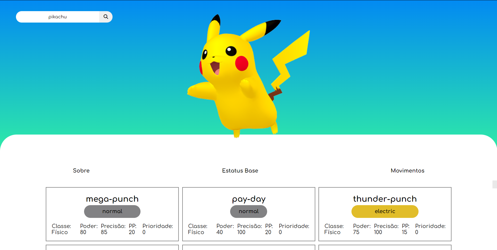

# Pokedéx

> Um projeto simples de pokedéx usando a PokéApi.

### Ajustes e melhorias

O projeto ainda está em desenvolvimento e as próximas atualizações serão voltadas nas seguintes tarefas:

- [ ] Pagina Home
- [x] Seleção Pessoal do pokemon
- [x] Responsividade
- [ ] Evoluções
- [ ] Pesquisa de movimentos no pokemon
- [ ] Tela dos movimentos

## 💻 Habilidades no Projeto

## 📝 Apis usadas
- https://pokeapi.co

## 🚀 Link para o Site

O projeto está hospedado com o hospedagem gratuita do github
<a href="https://dyegoanjos.github.io/Pokedex/" target="_blank" style="background-color: black;">Clique aqui</a>

## 😄 Confira esses e outros projetos no meu portfólio

## 📫 Redes sociais
- <a href="https://github.com/DyegoAnjos" target="_blank">GitHub</a>
- <a href="https://www.linkedin.com/in/dyego-cordeiro-8491891a3/" target="_blank">Linkedin</a>